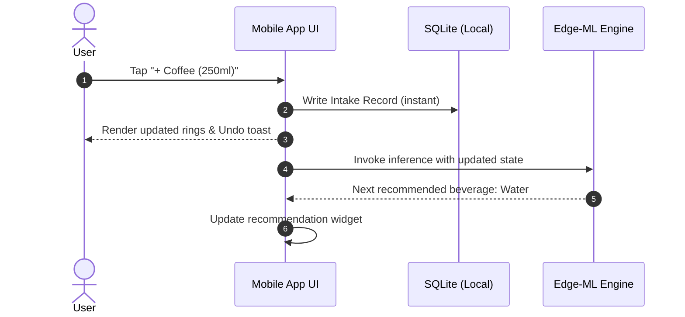
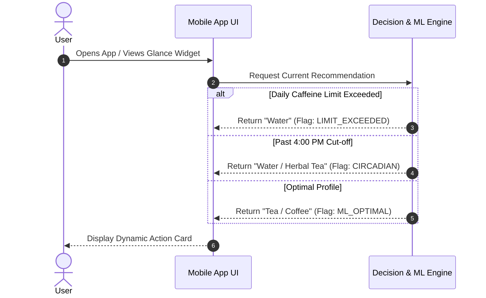
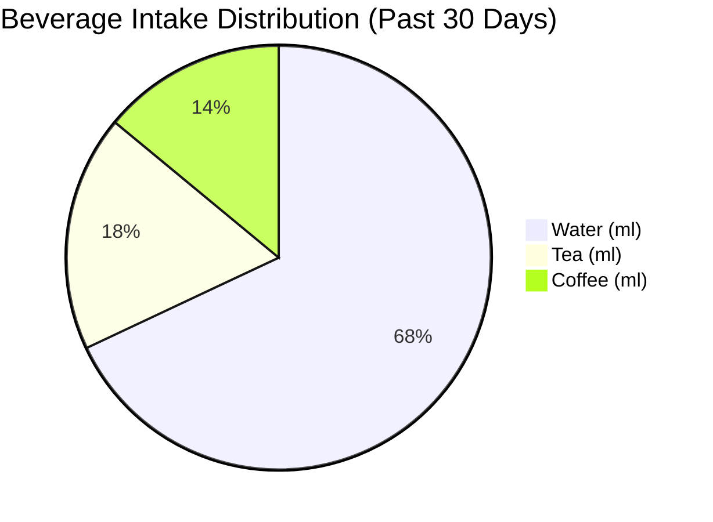

# BrewBalance

### 1️⃣ Title & Badges
- **App Name**: BrewBalance
- **Tagline**: Intelligent real-time hydration and caffeine optimization engine powered by Edge-ML.

[](https://opensource.org/licenses/MIT)
[](https://github.com/example/brewbalance)
[](https://github.com/example/brewbalance/actions)
[](https://github.com/example/brewbalance)
[](https://buymeacoffee.com/shanthistream)

---

### 2️⃣ Table of Contents
- [1️⃣ Title & Badges](#1️⃣-title--badges)
- [2️⃣ Table of Contents](#2️⃣-table-of-contents)
- [3️⃣ Overview](#3️⃣-overview)
- [4️⃣ Core Features](#4️⃣-core-features)
- [5️⃣ User Stories](#5️⃣-user-stories)
- [6️⃣ System Architecture Diagram](#6️⃣-system-architecture-diagram)
- [7️⃣ Data Model](#7️⃣-data-model)
- [8️⃣ API Specification](#8️⃣-api-specification)
- [9️⃣ Edge‑ML Model Design](#9️⃣-edge-ml-model-design)
- [🔟 Front‑End Wireframes](#🔟-front-end-wireframes)
- [1️⃣1️⃣ Dashboard & Visualisations](#1️⃣1️⃣-dashboard--visualisations)
- [1️⃣2️⃣ Notifications & Reminders](#1️⃣2️⃣-notifications--reminders)
- [1️⃣3️⃣ Security & Privacy](#1️⃣3️⃣-security--privacy)
- [1️⃣4️⃣ Technical Stack Recommendation](#1️⃣4️⃣-technical-stack-recommendation)
- [1️⃣5️⃣ Project Roadmap](#1️⃣5️⃣-project-roadmap-milestones)
- [1️⃣6️⃣ License & Contributing](#1️⃣6️⃣-license--contributing)
- [1️⃣7️⃣ Appendices](#1️⃣7️⃣-appendices)

---

### 3️⃣ Overview
Modern professionals frequently suffer from chronic afternoon dehydration and disrupted sleep architecture caused by uncontrolled caffeine intake. **BrewBalance** solves this dilemma by continuously tracking fluid intake, evaluating personalized threshold limits, and running an on-device Edge-ML inference model to deliver instant beverage recommendations (Tea, Coffee, or Water). The app targets desk workers, knowledge professionals, athletes, and biohackers striving to optimize sustained cognitive focus without compromising hydration or circadian rhythm.

---

### 4️⃣ Core Features
- **Intelligent Decision Engine**: Evaluates immediate biological need (tea vs. coffee vs. water) based on real-time physiological context and limits.
- **Multi-Modal Intake Logging**: Fast manual one-tap logging alongside optional QR code and NFC tag quick-scans on smart mugs/bottles.
- **Adaptive Limits & Guardrails**: User-defined thresholds across daily, weekly, and monthly periods (e.g., maximum caffeine, circadian cut-off times, hydration targets).
- **Edge-ML Recommendation Model**: Ultra-lightweight on-device classifier executing real-time inference in sub-10ms without server dependency.
- **Rich Dashboard & Visualizations**: Comprehensive analytics spanning daily to lifetime metrics with peak consumption hours and limit compliance scores.
- **Data Portability**: Full backup, export, and import support for standardized CSV and encrypted JSON formats.

---

### 5️⃣ User Stories

#### US-01: Quick Beverage Intake Logging
- **Story**: As a busy user, I want to log a cup of tea or coffee with a single tap so that tracking never interrupts my workflow.
- **Acceptance Criteria**:
  - Tapping a beverage quick-action button on Home registers an intake event in < 300ms.
  - Defaults to user's favorite volume (e.g., 250ml) with an undo snackbar visible for 5 seconds.

#### US-02: Hard Limit Enforcement & Water Prompting
- **Story**: As a health-conscious user, I want the app to warn me and recommend water when I reach my daily caffeine quota.
- **Acceptance Criteria**:
  - When cumulative caffeine meets or exceeds daily threshold, recommendation state transitions to `WATER_MANDATORY`.
  - Prominent UI banner details exceeded limit and suggests optimal water portion.

#### US-03: Circadian Caffeine Cut-off
- **Story**: As a sleep-sensitive user, I want caffeine suggestions blocked after 4:00 PM so my rest is unaffected.
- **Acceptance Criteria**:
  - Any beverage request after the configured hour suppresses coffee and caffeinated tea recommendations.
  - Suggests herbal tea or room-temperature water with explanatory physiological rationale.

#### US-04: Periodic Dehydration Alert
- **Story**: As a desk worker, I want periodic reminders when I haven't logged water for over 2 hours.
- **Acceptance Criteria**:
  - Triggers a subtle local push notification if `current_time - last_water_timestamp > 120 minutes` during active hours.
  - Direct action on the notification allows logging 250ml or 500ml directly.

#### US-05: Historical Consumption Analytics
- **Story**: As an analytical user, I want to view my weekly and monthly beverage breakdown so that I can calibrate habits.
- **Acceptance Criteria**:
  - Dashboard toggle switches between Daily, Weekly, Monthly, Yearly, and Lifetime views.
  - Visualizes ratio of water vs. caffeinated drinks, peak consumption intervals, and limit adherence percentage.

#### US-06: Offline-First Edge Inference
- **Story**: As a frequent traveler, I want instant beverage recommendations without internet access.
- **Acceptance Criteria**:
  - Edge-ML model generates predictions fully offline using local SQLite records.
  - Latency is under 15ms on mid-tier mobile hardware.

---

### 6️⃣ System Architecture Diagram

```mermaid
flowchart TD
    subgraph Client["Client Application (Flutter / React Native)"]
        UI["UI Layer / Dashboard"]
        Store["Local Cache / SQLite (Offline Store)"]
        EdgeML["Edge-ML Runtime (TensorFlow Lite / ONNX)"]
        Notifier["Local Notification Manager"]
    end

    subgraph EdgeDevice["Edge Device Boundary"]
        UI -->|Fetch Prediction| EdgeML
        UI -->|Read / Write Offline| Store
        Store -->|Feature Pipeline| EdgeML
        EdgeML -->|Trigger Alert| Notifier
    end

    subgraph Cloud["Cloud Infrastructure"]
        APIGW["API Gateway (Kong / Cloudflare)"]
        Backend["Backend Service (FastAPI / Node.js)"]
        DB[(TimescaleDB / PostgreSQL)]
        Trainer["Async Model Training Pipeline (PyTorch / Scikit-Learn)"]
        PushSvc["Remote Notification Service (APNs / FCM)"]
    end

    Store -.->|Periodic Background Sync| APIGW
    APIGW --> Backend
    Backend --> DB
    DB --> Trainer
    Trainer -->|Quantized Model Weights (.tflite)| Backend
    Backend -.->|Model Over-the-Air Update| Store
    Backend --> PushSvc
    PushSvc -.-> Client
```

- **Client App**: Cross-platform frontend rendering views, orchestrating offline storage, and executing Edge-ML inference.
- **Edge-ML Runtime**: Evaluates feature vectors locally on TFLite / ONNX Mobile for sub-second recommendations.
- **API Gateway**: Handles authentication, TLS termination, and traffic shaping.
- **Backend Service**: Business logic for account management, batch aggregation, and model artifact delivery.
- **PostgreSQL / TimescaleDB**: Time-series relational store handling intake events and audit logs.
- **Training Pipeline**: Re-trains personalized weights and exports quantized models.

---

### 7️⃣ Data Model

#### Entity: `User`
| Field Name | Type | Description | Example |
|---|---|---|---|
| `id` | `UUID` | Unique primary key for user account | `"a3f12c84-90b1-4d1a-8c7e-b6e3f421a111"` |
| `email` | `VARCHAR(255)` | User email address (unique) | `"alex.coder@example.com"` |
| `timezone` | `VARCHAR(64)` | IANA timezone string | `"America/New_York"` |
| `created_at` | `TIMESTAMPTZ` | Timestamp of account registration | `"2026-01-15T08:30:00Z"` |

#### Entity: `Intake`
| Field Name | Type | Description | Example |
|---|---|---|---|
| `id` | `UUID` | Unique identifier for the intake event | `"c72a81f3-23d9-4fa2-8b83-ff00192e45da"` |
| `user_id` | `UUID` | Foreign key referencing `User(id)` | `"a3f12c84-90b1-4d1a-8c7e-b6e3f421a111"` |
| `beverage_type` | `VARCHAR(20)` | Type: `water`, `tea`, `coffee` | `"tea"` |
| `volume_ml` | `INTEGER` | Volume ingested in milliliters | `250` |
| `caffeine_mg` | `FLOAT` | Estimated caffeine content in milligrams | `45.0` |
| `logged_at` | `TIMESTAMPTZ` | Timestamp when intake occurred | `"2026-09-11T14:32:00Z"` |
| `source` | `VARCHAR(20)` | Entry source: `manual`, `nfc`, `qr` | `"manual"` |

#### Entity: `Limit`
| Field Name | Type | Description | Example |
|---|---|---|---|
| `id` | `UUID` | Unique limit identifier | `"e90d18bc-21a4-477d-bb91-23a9d948cfbc"` |
| `user_id` | `UUID` | Foreign key referencing `User(id)` | `"a3f12c84-90b1-4d1a-8c7e-b6e3f421a111"` |
| `metric` | `VARCHAR(50)` | Metric: `max_caffeine_daily`, `min_water_daily`, `caffeine_cutoff_time` | `"max_caffeine_daily"` |
| `threshold_value`| `FLOAT` | Target value / limit constraint | `300.0` |
| `unit` | `VARCHAR(20)` | Unit of measurement: `mg`, `ml`, `time` | `"mg"` |
| `is_active` | `BOOLEAN` | Active switch for rule evaluation | `true` |

#### Entity: `RecommendationLog`
| Field Name | Type | Description | Example |
|---|---|---|---|
| `id` | `UUID` | Unique log entry identifier | `"1b2c3d4e-5f6a-7b8c-9d0e-1f2a3b4c5d6e"` |
| `user_id` | `UUID` | Foreign key referencing `User(id)` | `"a3f12c84-90b1-4d1a-8c7e-b6e3f421a111"` |
| `suggested_beverage`| `VARCHAR(20)` | Recommendation: `water`, `tea`, `coffee` | `"water"` |
| `confidence_score`| `FLOAT` | Edge model confidence metric [0.0 - 1.0] | `0.92` |
| `reason_code` | `VARCHAR(50)` | Rule reason: `LIMIT_EXCEEDED`, `CIRCADIAN_CUTOFF`, `DEHYDRATION` | `"LIMIT_EXCEEDED"` |
| `created_at` | `TIMESTAMPTZ` | Timestamp of recommendation generation | `"2026-09-11T15:00:00Z"` |

```json
{
  "$schema": "https://json-schema.org/draft/2020-12/schema",
  "title": "IntakeRecord",
  "type": "object",
  "required": ["id", "userId", "beverageType", "volumeMl", "caffeineMg", "loggedAt", "source"],
  "properties": {
    "id": { "type": "string", "format": "uuid" },
    "userId": { "type": "string", "format": "uuid" },
    "beverageType": { "type": "string", "enum": ["tea", "coffee", "water"] },
    "volumeMl": { "type": "integer", "minimum": 10, "maximum": 5000 },
    "caffeineMg": { "type": "number", "minimum": 0.0, "maximum": 1000.0 },
    "loggedAt": { "type": "string", "format": "date-time" },
    "source": { "type": "string", "enum": ["manual", "nfc", "qr"] }
  },
  "additionalProperties": false
}
```

---

### 8️⃣ API Specification

#### 1. Beverage Intake: `POST /intake` & `GET /intake`
- **POST /intake**
  - **Request Body**:
    ```json
    {
      "beverageType": "coffee",
      "volumeMl": 250,
      "caffeineMg": 95.0,
      "loggedAt": "2026-09-11T15:30:00Z",
      "source": "manual"
    }
    ```
  - **Response (201 Created)**:
    ```json
    {
      "status": "success",
      "data": {
        "id": "fa422a89-21cb-4bc1-912f-9cb48fa29810",
        "beverageType": "coffee",
        "volumeMl": 250,
        "caffeineMg": 95.0,
        "loggedAt": "2026-09-11T15:30:00Z",
        "syncedAt": "2026-09-11T15:30:02Z"
      }
    }
    ```
  - **HTTP Status Codes**: `201 Created`, `400 Bad Request`, `401 Unauthorized`.

#### 2. User Limits: `GET /limits` & `PUT /limits`
- **PUT /limits**
  - **Request Body**:
    ```json
    {
      "limits": [
        { "metric": "max_caffeine_daily", "thresholdValue": 300, "unit": "mg", "isActive": true },
        { "metric": "min_water_daily", "thresholdValue": 2500, "unit": "ml", "isActive": true },
        { "metric": "caffeine_cutoff_hour", "thresholdValue": 16, "unit": "hour", "isActive": true }
      ]
    }
    ```
  - **Response (200 OK)**:
    ```json
    {
      "status": "success",
      "message": "User thresholds successfully updated",
      "updatedCount": 3
    }
    ```
  - **HTTP Status Codes**: `200 OK`, `400 Bad Request`, `401 Unauthorized`.

#### 3. Real-Time Recommendation: `GET /recommendation`
- **Request Parameters**: None (derives context from auth token, current time, and recent logs).
- **Response (200 OK)**:
  ```json
  {
    "recommendedBeverage": "water",
    "confidenceScore": 0.94,
    "reasonCode": "LIMIT_EXCEEDED",
    "message": "You have consumed 320mg caffeine today (Limit: 300mg). Refresh with 300ml cold water.",
    "currentStats": {
      "todayCaffeineMg": 320.0,
      "todayWaterMl": 1100,
      "minutesSinceLastIntake": 75
    }
  }
  ```
- **HTTP Status Codes**: `200 OK`, `401 Unauthorized`, `500 Server Error`.

#### 4. Analytics Dashboard: `GET /dashboard/:range`
- **Path Parameter**: `:range` (`day`, `week`, `month`, `year`, `lifetime`)
- **Response (200 OK)**:
  ```json
  {
    "range": "week",
    "totalWaterMl": 14500,
    "totalCaffeineMg": 1120.0,
    "intakeBreakdown": {
      "waterPercentage": 68.5,
      "teaPercentage": 19.5,
      "coffeePercentage": 12.0
    },
    "complianceScore": 88.5,
    "peakConsumptionHour": 10,
    "series": [
      { "date": "2026-09-05", "waterMl": 2200, "caffeineMg": 180 },
      { "date": "2026-09-06", "waterMl": 1900, "caffeineMg": 140 }
    ]
  }
  ```
- **HTTP Status Codes**: `200 OK`, `400 Invalid Range`, `401 Unauthorized`.

---

### 9️⃣ Edge‑ML Model Design

#### Feature Vector Specification
The input vector $\mathbf{x} \in \mathbb{R}^{10}$ comprises:
1. `time_of_day_normalized`: Float $[0.0, 1.0]$ representing current time (`hour / 24.0`).
2. `day_of_week`: One-hot or circular coordinate $[\sin(2\pi d/7), \cos(2\pi d/7)]$.
3. `caffeine_consumed_today_ratio`: `today_caffeine_mg / max_caffeine_daily_limit`.
4. `water_consumed_today_ratio`: `today_water_ml / min_water_daily_target`.
5. `minutes_since_last_intake`: Normalized integer.
6. `last_intake_type`: Categorical encoded (`0: water, 1: tea, 2: coffee`).
7. `intakes_count_past_6h`: Total count of drinks logged in trailing 6 hours.
8. `is_after_cutoff_hour`: Binary flag (`1` if `current_hour >= cutoff_hour`, else `0`).

#### Model Selection: Quantized Multi-Layer Perceptron (< 10 KB)
- **Architecture**: Feedforward Dense Neural Net: Input(10) $\to$ Dense(16, ReLU) $\to$ Dense(8, ReLU) $\to$ Dense(3, Softmax).
- **Size & Format**: 8-bit quantized TensorFlow Lite model (`model_quant.tflite`), footprint $\approx 6.4 \text{ KB}$.
- **Edge Justification**: Ultra-minimal memory footprint, zero network dependency, deterministic runtime latency ($\approx 4\text{ms}$), preserving maximum user data privacy.

#### Inference Pseudo-Code
```python
def predict_beverage(features: dict, user_limits: dict) -> tuple[str, float, str]:
    # Hard Rule Guardrails (Pre-ML Filter)
    if features["caffeine_mg_today"] >= user_limits["max_caffeine_daily"]:
        return "water", 1.0, "LIMIT_EXCEEDED"
    if features["current_hour"] >= user_limits["cutoff_hour"]:
        return "water", 0.98, "CIRCADIAN_CUTOFF"

    # Edge-ML Tensor Inference
    input_vector = normalize_and_pack_features(features, user_limits)
    tflite_interpreter.set_tensor(input_tensor_index, input_vector)
    tflite_interpreter.invoke()
    probabilities = tflite_interpreter.get_tensor(output_tensor_index)[0]
    
    classes = ["water", "tea", "coffee"]
    predicted_idx = argmax(probabilities)
    return classes[predicted_idx], float(probabilities[predicted_idx]), "ML_OPTIMAL"
```

#### Training Pipeline
Server runs a nightly batch job via PyTorch/Scikit-Learn over anonymized telemetry. The model weights are quantized with Post-Training Quantization (PTQ) into INT8 `.tflite` format and dispatched to clients via over-the-air binary sync during low-bandwidth windows.

---

### 🔟 Front‑End Wireframes

#### Log Intake Flow


#### Receive Recommendation Flow


#### Screen Layout Sketches (ASCII)
```text
+-------------------------+  +-------------------------+
| [BrewBalance]     (9)   |  | [< Back] Quick Log      |
|                         |  |                         |
|   RECOMMENDATION CARD   |  | Select Beverage:        |
|  +-------------------+  |  | [ Tea ] [Coffee] [Water]|
|  |  Drink: WATER     |  |  |                         |
|  |  Reason: Quota reached| | Portion Size:           |
|  |  [ Log 250ml Now] |  |  | (o) 250ml  ( ) 500ml    |
|  +-------------------+  |  |                         |
|                         |  | Caffeine: ~95 mg        |
| Daily Rings:            |  | Time: 15:30 (Now)       |
| Hydration: [||||||..]72%|  |                         |
| Caffeine:  [||||||||]100%  | [ SCAN NFC / QR CUP ]   |
|                         |  |                         |
| [Home] [Stats] [Config] |  | [    CONFIRM LOG    ]   |
+-------------------------+  +-------------------------+
       Home Screen                    Log Screen
```

---

### 1️⃣1️⃣ Dashboard & Visualisations
- **Line Chart**: Continuous hourly intake over time comparing water vs. caffeine intake.
- **Bar Chart**: Cumulative hourly caffeine distribution highlighting peak stimulation hours.
- **Donut Chart**: Proportion share of consumed beverages (Tea %, Coffee %, Water %).
- **Adherence Heatmap**: Weekly matrix plotting compliance against custom limit constraints.

#### Mermaid Data Visualization Placeholders



```mermaid
%%{init: {'theme':'neutral'}}%%
graph LR
    subgraph IntakeVolumeOverWeek [Intake Volume Over Time (L)]
        Mon[Mon: 2.4L] --> Tue[Tue: 2.1L]
        Tue --> Wed[Wed: 2.8L]
        Wed --> Thu[Thu: 2.5L]
        Thu --> Fri[Fri: 2.0L]
        Fri --> Sat[Sat: 3.1L]
        Sat --> Sun[Sun: 2.9L]
    end
```

- **Recommended Chart Libraries**: **Recharts** (React Native Web / Web SPA) or **FL Chart** / **Syncfusion Flutter Charts** (Native Flutter).

---

### 1️⃣2️⃣ Notifications & Reminders
1. **Limit Overrun Alert**: Dispatched immediately upon an intake event crossing 100% of defined daily/weekly thresholds:
   - *"Threshold Alert: You've reached your daily 300mg caffeine limit. Switch to water to protect your nervous system."*
2. **Dehydration Warning**: Scheduled locally using the device alarm manager when no fluid record is added for $> 120$ active minutes:
   - *"Hydration Pause: It's been 2.5 hours since your last drink. Rehydrate with 300ml of water now."*
3. **Evening Circadian Guard**: Triggered at the user-defined caffeine cut-off hour (e.g., 16:00):
   - *"Caffeine Cut-off Reached: Coffee and black tea are now paused for the day to optimize deep sleep tonight."*

---

### 1️⃣3️⃣ Security & Privacy
- **Cryptographic Protection**: AES-256 encryption at rest for local SQLite caches; TLS 1.3 enforced for all network transitions.
- **Zero-Knowledge Sync & Privacy**: Sensitive beverage and health logs are pseudonymized with randomly rotated UUIDs.
- **GDPR / CCPA Compliance**: Explicit consent modals, one-click export for full data history, and instant irreversible account purge (`DELETE /user/me`).
- **Full Air-Gapped Local-Only Mode**: Users can toggle off cloud synchronization entirely; all analytics, storage, and ML models execute exclusively on-device without outbound packet transmission.

---

### 1️⃣4️⃣ Technical Stack Recommendation

| Layer | Recommended Tech | Reason |
|---|---|---|
| Front‑end | **Flutter** (Dart) or **React Native** (TS) | Native 60 FPS performance, cross-platform code sharing, background tasks. |
| Backend | **FastAPI** (Python) or **Node.js / Express** | High-throughput asynchronous routing and native integration with Python ML tools. |
| Database | **PostgreSQL** + **TimescaleDB** | Hypertable partitioning enables rapid analytical rollups on time-series telemetry. |
| Edge‑ML | **TensorFlow Lite** / **ONNX Runtime Mobile** | Sub-10 KB memory footprint, executes sub-10ms predictions directly on hardware. |
| DevOps | **Docker Compose** + **GitHub Actions** | Reproducible builds, linting, integration pipelines, and automated test triggers. |
| Testing | **Jest** (Client), **PyTest** (Backend), **TFLite Benchmark** | Comprehensive test coverage across UI, endpoints, and inference correctness. |

---

### 1️⃣5️⃣ Project Roadmap (Milestones)
- **Phase 1: MVP Core**: Manual intake logging (tea/water), local storage, and basic water prompt engine.
- **Phase 2: Expanded Beverage Engine & Limits**: Coffee integration, caffeine calculation, custom thresholds, and local alert scheduling.
- **Phase 3: Edge-ML Intelligence**: Feature extractor, on-device TFLite runtime integration, and adaptive recommendations.
- **Phase 4: Advanced Dashboard & Biometrics**: Interactive charts (FL Chart / Recharts), peak consumption heatmaps, and compliance score.
- **Phase 5: Hardware Scans & Data Mobility**: NFC tag / QR cup scanning, multi-format CSV/JSON import/export, and zero-knowledge cloud backup.

---

### 1️⃣6️⃣ License & Contributing
Licensed under the **MIT Open Source License**.

```text
MIT License
Copyright (c) 2026 BrewBalance Contributors
Permission is hereby granted, free of charge, to any person obtaining a copy
of this software and associated documentation files (the "Software"), to deal
in the Software without restriction...
```

#### Contributing Guidelines
1. Fork repository (`https://github.com/example/brewbalance`).
2. Create topic branch: `git checkout -b feature/smart-rehydration-algo`.
3. Validate tests and style: `npm test` or `pytest && flutter test`.
4. Submit Pull Request with detailed acceptance criteria and test evidence.

---

### 1️⃣7️⃣ Appendices

#### Sample Intake Data (CSV)
```csv
id,user_id,beverage_type,volume_ml,caffeine_mg,logged_at,source
e101,u882,coffee,250,95.0,2026-09-11T08:15:00Z,manual
e102,u882,water,500,0.0,2026-09-11T09:45:00Z,nfc
e103,u882,tea,300,45.0,2026-09-11T11:30:00Z,manual
e104,u882,water,350,0.0,2026-09-11T13:45:00Z,manual
e105,u882,water,250,0.0,2026-09-11T15:20:00Z,qr
```

#### Glossary
- **Caffeine-Equivalent**: Standardized measure calculating stimulatory impact relative to 100ml brewed drip coffee.
- **Standard Cup**: Default liquid serving normalized to 250 milliliters ($8.45\text{ fl oz}$).
- **Circadian Cut-off**: Personalized hour threshold after which no adenosine-blocking agents are recommended.

#### References
- *Effects of Caffeine on Sleep Quality and Circadian Timing*, Sleep Medicine Reviews (2023).
- *TensorFlow Lite for Mobile & Embedded Devices*: https://www.tensorflow.org/lite
- *European Food Safety Authority (EFSA) Scientific Opinion on the Safety of Caffeine*: https://www.efsa.europa.eu
